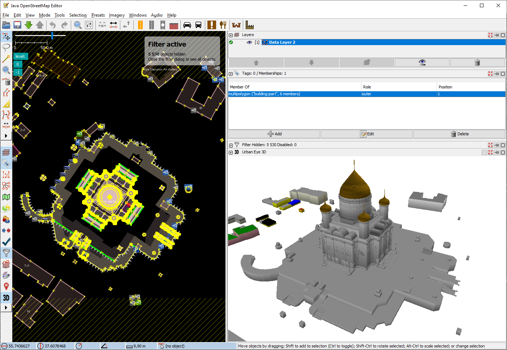
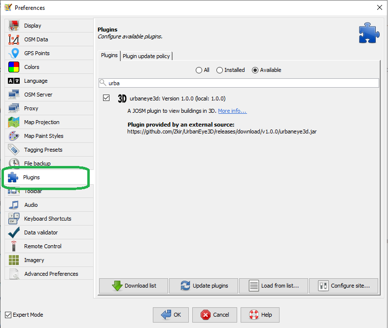

# Urban Eye 3D – JOSM 3D Viewer Plugin

**Urban Eye 3D** is a JOSM plugin that provides a dedicated 3D view (dockable or floating) to visualize loaded buildings and building parts (`building=*` and `building:part=*`).

## Benefits for Mappers

While 3D visualization of OSM data has existed for years through external tools, the absence of a dedicated 3D viewer in JOSM (particularly since the discontinuation of [Kenzi 3D](https://github.com/kendzi/kendzi3d)) has been a notable gap. 

Urban Eye 3D solves this problem! Mappers and 3D building enthusiasts can now preview their edits directly within JOSM before commiting changes to OpenStreetMap.

## Key Features
* Support of the [Simple 3D Buildings](https://wiki.openstreetmap.org/wiki/Simple_3D_Buildings) specification
* Visualization only  – no editing or export functionality
* Intuitive navigation, simlar to modern 3d editors:  
  - Orbit (left mouse drag)  
  - Zoom (mouse wheel)
  - Pan (right mouse drag)
* Basic color support for `building:colour` and `roof:colour` tags
* Two modes: *solid* and *wireframe*. Press 'z' to switch between them
* Real-time updates: Changes made in JOSM instantly reflect in the 3D view

### Limitations
* Several roof shapes (`gabled`, `gambrel`, `hipped`, `round` and some others) are supported for quadrilateral polygons. 
Support of those roof shapes for arbitrary non-convex polygons may be added in future versions.

## How to install
Please install the Urban Eyer 3D just like any other plugin in JOSM:

1. In JOSM, open the menu **Edit → Preferences**, find the **Plugins** tab.
2. If needed, hit the **"Download list"** button,
3. Select the **"Available"** radio button,
4. Type **"urba..."** in the search field,
5. Don’t forget to **check the box**,
6. Enjoy!

## Licensing
Inspired by the GNU GPL-licensed [Blosm](https://github.com/vvoovv/blosm) project and following JOSM's [plugin licensing recommendations](https://josm.openstreetmap.de/wiki/DevelopersGuide/DevelopingPlugins#LegalStuff), this code is licensed under [GNU GPL v3](LICENSE).

## Contributing
Contributions are welcome! Please discuss significant code changes via issue tickets before submitting pull requests.

### AI Development Notes
As artificial intelligence reshapes development in 2025, [GEMINI.md](GEMINI.md) contains insights valuable to both silicon-based and protein-based programmers.

---

The Urban Eye is watching!  

