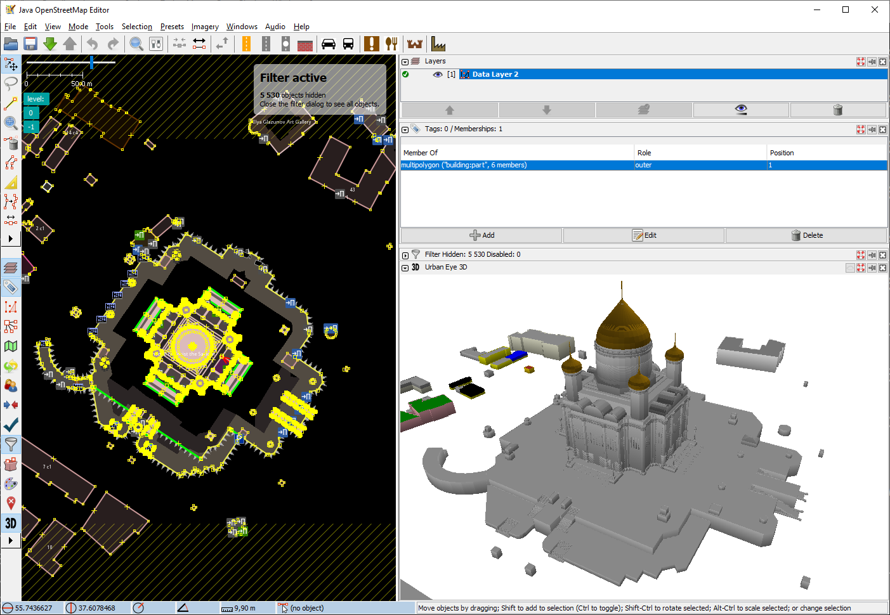
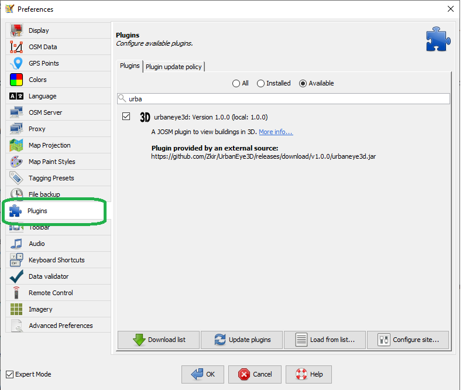

# Urban Eye 3D – JOSM 3D Viewer Plugin

**Urban Eye 3D** is a JOSM plugin that provides a dedicated 3D view (dockable or floating) to visualize loaded buildings and building parts (`building=*` and `building:part=*`).

## Benefits for Mappers

While 3D visualization of OSM data has existed for years through external tools, the absence of a dedicated 3D viewer in JOSM (particularly since the discontinuation of [Kenzi 3D](https://github.com/kendzi/kendzi3d)) has been a notable gap. 

Urban Eye 3D solves this problem! Mappers and 3D building enthusiasts can now preview their edits directly within JOSM before commiting changes to OpenStreetMap.

## Key Features
* 3D visualization of building models according to [Simple 3D Buildings](https://wiki.openstreetmap.org/wiki/Simple_3D_Buildings) specification
* Visualization of Earth surface with flat objects: roads, rivers, grassland and others.
* Intuitive navigation, similar to modern 3D editors:  
  - Orbit (left mouse drag)  
  - Zoom (mouse wheel)
  - Pan (right mouse drag)
* Two modes: *solid* and *wireframe*. Press 'z' to switch between them
* Real-time updates: Changes made in JOSM instantly reflect in the 3D view
* Rendering only – no editing or export functionality

See [features.md](docs/features.md) for the list of supported tags and roof shapes.

### Limitations
* Several roof shapes (`mansard`, `half-hipped` and `cross_gabled`) are supported for quadrilateral polygons only. 
Support for those roof shapes on arbitrary non-convex polygons may be added in future versions.

## How to install
Please install Urban Eye 3D just like any other plugin in JOSM:

1. In JOSM, open the menu **Edit → Preferences**, find the **Plugins** tab.
2. If needed, hit the **"Download list"** button,
3. Select the **"Available"** radio button,
4. Type **"urba..."** in the search field,
5. Don’t forget to **check the box**,
6. Enjoy!

## Supported platforms
As a JOSM plugin written in *pure Java*, it works perfectly on **Windows**, **Mac**, and **Linux**. 
Some users have reported problems with graphics drivers on certain Linux distributions, but with Linux, you're on your own :)

## Licensing
Inspired by the GNU GPL-licensed [Blosm](https://github.com/vvoovv/blosm) project and following JOSM's [plugin licensing recommendations](https://josm.openstreetmap.de/wiki/DevelopersGuide/DevelopingPlugins#LegalStuff), this code is licensed under [GNU GPL v3](LICENSE).

The licensing for third-party assets used in this project (such as textures) is detailed in the [ASSET-LIST.md](docs/ASSET-LIST.md) file.

## Contributing
Contributions are welcome!  
* See the [the Contribution guide](CONTRIBUTING.md) in case you would like to contribute code or artwork.
* You can also contribute to this project by giving us a star :)

<a href="https://www.star-history.com/?repos=Zkir%2FUrbanEye3D&type=date&legend=top-left">
 <picture>
   <source media="(prefers-color-scheme: dark)" srcset="https://api.star-history.com/chart?repos=Zkir/UrbanEye3D&type=date&theme=dark&legend=top-left&sealed_token=eIh3Jv4BPXiLMCqGWcxjPJ5A0y2RjgmxT6SNJcL7cx065vmd54JFkTaBkMjANlSpCBRZNdALRFCoHIa9-PgDpzy4bqTOQPX0UR7M7lUuXt5Ok9HbIOrJ7xpMR18J5Ygx-A8vEvtwCEQ3iJKO-gaHfmPEzljGGHz1GhSAlZgeaj3-h9XaMvs_hkJgIMP3" />
   <source media="(prefers-color-scheme: light)" srcset="https://api.star-history.com/chart?repos=Zkir/UrbanEye3D&type=date&legend=top-left&sealed_token=eIh3Jv4BPXiLMCqGWcxjPJ5A0y2RjgmxT6SNJcL7cx065vmd54JFkTaBkMjANlSpCBRZNdALRFCoHIa9-PgDpzy4bqTOQPX0UR7M7lUuXt5Ok9HbIOrJ7xpMR18J5Ygx-A8vEvtwCEQ3iJKO-gaHfmPEzljGGHz1GhSAlZgeaj3-h9XaMvs_hkJgIMP3" />
   
 </picture>
</a>

---

The Urban Eye is watching!  

