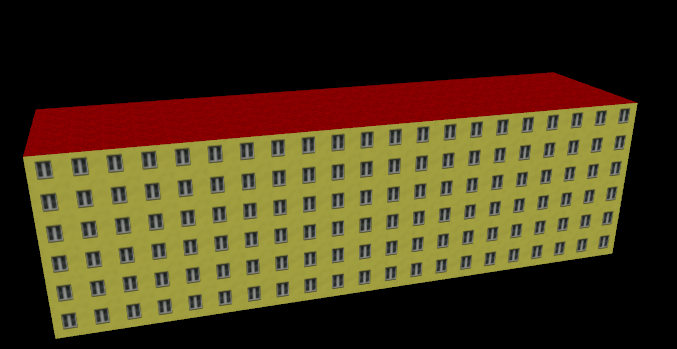
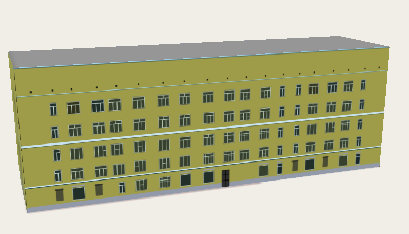
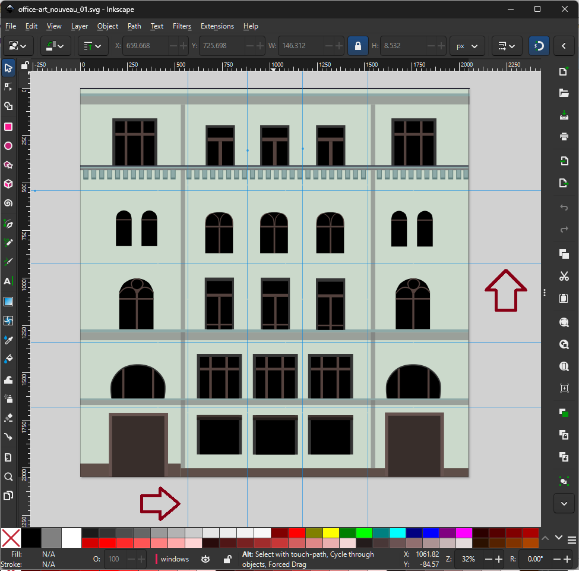

# How to Create Facades for UrbanEye3D

This document explains how to create new facades for the UrbanEye3D plugin to enhance the visual realism of buildings.

## Introduction: What are Facades and Why Are They Needed?

### The Problem
It is impossible to create a realistic-looking building using a simple repeating (tiling) texture. The very nature of architecture makes this approach fail. 



The best that can be achieved with tiling texture (screenshot from osm2world).  Problems: 

* Dull and not eye-pleasing even for modernist apartment building.
* There are no entrances! People cannot get inside!
* All windows are the same size.  Typical building has windows of several different sizes.
* All windows have the same window frame. In most parts of the world each household can choose the glazing options itself.  
* The side clearances between windows and facade edges on left/right are unrealistically small.
* Also, gaps between the top‑floor windows and the flat roof are unrealistically small too.  That’s not how real buildings work. The ceiling of the top floor cannot be directly under the roof. In the case of a flat roof, a small half‑floor (an attic or service space) is usually built between the top‑floor ceiling and the roof itself.

A real building is not monotonous; its parts are specialized:
*   The **ground floor** is almost always unique. It contains main entrances and doors, which would look absurd if repeated on the 10th story. Its windows are often different, sometimes replaced by large shopfronts in retail buildings.
*   The **top floor** also stands out, crowned with a cornice or other decorative elements. In case of a flat roof, it is of different height and have some build-up for a roof.
*   **Balconies** are rarely present on the ground floor but are common on upper levels.
*   The **edges of a facade** (left and right) are frequently distinct from the middle section. Even on simple buildings, the corners are often accentuated with decorative elements like pilasters or rustication.

A simple tiling texture cannot handle this complexity.

This is the problem that the **facade system** solves.

### The Solution

Imagine you have a single, high-quality texture of a complete facade. It looks perfect, but only for a building of a very specific size, for instance, three stories high and twenty meters wide. This texture already contains all the necessary architectural elements: a unique ground floor, a top floor with a cornice, and distinct left and right edges.

The challenge is: how can we use this single texture for a building of *any* size — say, ten stories high and fifty meters wide — without it looking stretched, squashed, or unnaturally repetitive?

The solution is to conceptually "slice" this source texture into **logical zones** and define rules for how they are reassembled. These zones are:
*   `LEFT` and `RIGHT`: The non-repeatable vertical edges of the facade.
*   `TOP` and `BOTTOM`: The non-repeatable horizontal strips for the roofline/cornice and the ground floor.
*   `CENTER`: A repeatable horizontal section of a wall.
*   `MIDDLE`: A repeatable vertical section for the typical floors between the top and bottom.

The assembly then follows a simple but powerful set of rules: the `LEFT`, `RIGHT`, `TOP`, and `BOTTOM` zones are used once as "caps" at the building's edges. The `CENTER` and `MIDDLE` zones act as "fillers," repeated as many times as necessary to achieve the required width and height.

Furthermore, you can define multiple different `CENTER` and `MIDDLE` sections. This provides the necessary variability, as the renderer can pick between them when assembling the wall, preventing a monotonous, repeating pattern.



_Much more believable building. At least, it has an entrance, some varierty in windows and technical attic between the top floor and the roof, as well as some decorative elements._

Obviously, this approach cannot solve all the architectural challenges. For instance, complex classical buildings with central [risalits](https://de.wikipedia.org/wiki/Risalit) cannot be fully represented with this system.
However, for a huge mass of buildings, it yields acceptable results, creating structures that pass the eye test. 

### The Implementation in Files

This concept is implemented using two simple file types:
*   The **`.fac` file** is a text file that contains the description of these logical zones (slices), defining their coordinates on the texture and their repetition rules.
*   The **`.png` file** is the actual texture image—the palette of components—that is being sliced.

## The Easy Way: Recommended Workflow

We have a streamlined process for creating facades that automates the most tedious parts. The recommended workflow is to design your facade in a vector graphics editor like **Inkscape**, and then use a helper script to generate the `.fac` file.

### Step 1: Design the Facade in Inkscape (`.svg`)

1.  Create a new SVG document. This will be the source for your texture atlas.
2.  Draw all the parts of your facade. Arrange them logically. A good practice is to have distinct horizontal bands for the ground floor, repeating middle floors, and the top floor/cornice.
3.  **Crucially, use guides to mark the divisions.** The helper script uses these guides to define how the texture should be sliced.
    *   **Horizontal Guides**: Place these to separate the vertical sections of the facade (e.g., `BOTTOM`, `MIDDLE`, `TOP` floors).
    *   **Vertical Guides**: Place these to separate the horizontal sections of the facade (e.g., `LEFT`, `CENTER`, `RIGHT` wall panels). These define which parts can be repeated to stretch the facade horizontally.

<a href="images/inkscape_guides.png"> </img></a>


#### Use Transparency for Wall Color
When designing the texture in SVG (and exporting to PNG), it is highly recommended to **leave the base color of the walls transparent**. Do not draw a colored background for your wall sections.

The plugin will automatically detect this transparency and color the wall using the value from the building's `building:colour` tag in OSM. This allows one facade to be used for buildings of many different colors.

All other decorative elements (window frames, cornices, doors, etc.) should be drawn with their own specific, **opaque** colors.

### Step 2: Generate and Refine the `.fac` file

We have a Python script, `asset_sources/guides.py`, that reads the guides from your SVG file and generates an excellent boilerplate `.fac` file to get you started.

1.  Open a command line in the project root directory.
2.  Run the script, passing the path to your SVG file as an argument:
    ```sh
    python asset_sources/guides.py path/to/your/facade.svg
    ```
3.  The script will print a ready-to-use `.fac` file content to the console. Copy this content and save it as `facade_name.fac` in the `src/main/resources/facades/` directory.

The generated file will contain the `TEXTURE` path and all the slicing directives (`BOTTOM/MIDDLE/TOP`, `LEFT/CENTER/RIGHT`) based on your guides. However, this file is a starting point, and you will likely need to edit it manually for more advanced cases.

#### When to Manually Edit the `.fac` File

You should edit the generated `.fac` file in the following common scenarios:

**1. You have multiple options for end-caps (or none).**

The script creates exactly one `LEFT`, `RIGHT`, `TOP`, and `BOTTOM` slice from the outermost guides. Your design, however, might have several different styles for corners or rooflines. In this case, you can manually add more `LEFT`, `RIGHT`, etc., directives to the `.fac` file, each pointing to a different section of your texture. The renderer will then randomly pick one of the available options.

**2. You need different layouts for long and short walls.**

A building's facade often looks different on its long side compared to its short side. The script generates a single `WALL` definition, but you can create multiple `WALL` sections for different wall length ranges.

To do this, manually edit the `.fac` file:
*   Create two or more `WALL <min_width> <max_width>` sections (e.g., `WALL 1 15` for short walls and `WALL 15 1000` for long walls).
*   Copy the slicing directives (`LEFT`, `CENTER`, `TOP`, etc.) into each `WALL` section.
*   Customize the slices within each section. For example, in the "long wall" definition, you might include more `CENTER` slices with various windows, while the "short wall" might use fewer, or different, slices.

### Step 3: Export the Texture (`.png`)

Export your final SVG design to a PNG file.
*   The file name must match the one specified in the `TEXTURE` directive of your `.fac` file.
*   Save the `.png` file in the same directory: `src/main/resources/facades/`.

### Step 4: Register the Facade in `facades.cfg`

The last step is to tell the plugin when to use your new facade. This is done by adding rules to the `src/main/resources/facades/facades.cfg` file.

1.  Open `facades.cfg`.
2.  Add a new entry. The format is the name of your `.fac` file, followed by indented lines with `key=value` OSM tags that must match for this facade to be applied.

**Example:** To make `my_new_facade.fac` apply to all residential buildings with a constructivism architecture style, you would add:

```
my_new_facade.fac
    building=residential
    building:architecture=constructivism
```

The plugin selects facades based on how well they match the OSM tags of a building. More specific rules (with more tags) have higher priority.


## Deep Dive: The `.fac` File Format

This section details the format for contributors who want to write or edit `.fac` files manually. 
Our project uses a subset of X-Plane facade format **version 800** specification.

A `.fac` file is a sequence of commands, one per line.

| Command         | Parameters                             | Description                                                                                             |
| --------------- | -------------------------------------- | ------------------------------------------------------------------------------------------------------- |
| `A`             | (none)                                 | File format identifier. Must be the first line.                                                         |
| `800`           | (none)                                 | Version number. Must be the second line.                                                                |
| `FACADE`        | (none)                                 | File type identifier. Must be the third line.                                                           |
| `TEXTURE`       | `path/to/texture.png`                  | Specifies the texture atlas file. The path is relative to the `.fac` file.                              |
| `RING`          | `0` or `1`                             | `1` for closed loops (buildings), `0` for open chains (fences).                                         |
| `TWO_SIDED`     | `0` or `1`                             | `1` if the texture has transparency and both sides should be rendered. For solid walls, use `0`.        |
| `LOD`           | `<near_dist>` `<far_dist>`             | Level of Detail. Specifies the distances (in meters) at which this facade definition is visible.        |
| `WALL`          | `<min_width>` `<max_width>`            | Defines a set of rules for walls of a certain width range (in meters). You can have multiple `WALL` sections for different wall lengths. |
| `SCALE`         | `<horiz_meters>` `<vert_meters>`       | **(Inside a `WALL` block)** Sets the real-world size of the entire texture atlas in meters, used for scaling. Sould be repeated for each wall.    |
| `BOTTOM`/`MIDDLE`/`TOP` | `<start_t>` `<end_t>`          | **(Inside a `WALL` block)** Defines a vertical slice of the texture. `t` is a coordinate from 0.0 (bottom) to 1.0 (top). `MIDDLE` slices can be repeated. |
| `LEFT`/`CENTER`/`RIGHT` | `<start_s>` `<end_s>`          | **(Inside a `WALL` block)** Defines a horizontal slice of the texture. `s` is a coordinate from 0.0 (left) to 1.0 (right). `CENTER` slices can be repeated. |


## Deep Dive: The `facades.cfg` File - The Selection Engine

The primary purpose of `facades.cfg` is not simply to be a list of available facades. Its main goal is to serve as a **rule engine for selecting the most suitable facade** for a given building based on its OSM tags.

This approach is fundamental to how the plugin works. It is **not possible** to specify a facade file directly in OSM tags (e.g., by tagging `facade=my_facade.fac`). Such a tag would violate the core OSM principle of verifiability, as it doesn't describe a real-world, on-the-ground feature of the building. Instead, we describe the building's real-world features (`building=...`, `building:architecture=...`), and the plugin uses `facades.cfg` to find the best artistic representation.

*   **Structure**: Each entry starts with the facade filename (e.g., `industrial_01.fac`).
*   **Rules**: Following the filename, one or more indented lines specify the matching criteria in `key=value` format. The main tags used for selection are `building=*` and `building:architecture=*`, but any tags, like `building:levels` or `roof:shape`, can be used.
*   **Matching Logic**: All rule lines under a facade name must match for that facade to be considered (AND logic).
*   **Scoring and Specificity**: The plugin uses a scoring system to find the best match. A facade with more matching, specific tags will always be chosen over a more generic one. For example, for a brick industrial building, a rule for `building=industrial, building:material=brick` will win against a rule that only specifies `building=industrial`.
*   **Fallbacks**: You can use wildcards like `building=*` to create generic fallback facades that apply when no specific match is found.

**Example from the project:**
```
# A specific rule for retail buildings in a particular architectural style
retail-stalinist_neoclassicism_01.fac	
    building=retail, building:architecture=stalinist_neoclassicism
	
# A generic fallback for any 2-story building, used if no better match is found
building-any-2f.fac	
    building=*, building:levels=2
```

## See Also
1. [X-Plane Facade Creation](https://developer.x-plane.com/article/facade-creation/)
2. [X-Plane Facade Overview](https://developer.x-plane.com/article/facade-overview/)
