# Supported Features

This document outlines the OpenStreetMap tags supported by the UrbanEye3D plugin for rendering 3D buildings.

## Buildings

The plugin visualizes objects tagged with `building` and `building:part`.

### Height and Levels

The following tags are used to determine the dimensions of the building:

- `height`: The total height of the building, including the roof.
- `building:height`: An alternative to `height`.
- `min_height`: The height of the building's base from the ground.
- `building:levels`: The number of floors. This is used to calculate the building's height if `height` is not specified (assuming a default height per level).
- `building:min_level`: The number of floors the building is raised from the ground.

### Roof Dimensions

- `roof:height`: The height of the roof.
- `roof:levels`: The number of levels the roof occupies. Used to calculate `roof:height` if not specified.

### Color and Material

- `building:colour` or `colour`: The color of the building's walls.
- `roof:colour`: The color of the roof.
- `building:material`: The material of the walls. This can influence the default color.
- `roof:material`: The material of the roof. This can influence the default color.

### Other Tags

- `roof:direction`: Specifies the direction for certain roof types, like `skillion`. Can be a numerical value (0-360) or a cardinal direction (N, E, S, W as well as NE, SW, etc.).
- `roof:orientation`: Defines the orientation for roofs like `gabled` and `saltbox` (e.g., `along` or `across`).

## Supported Roof Shapes (`roof:shape`)

Below is a list of all supported `roof:shape` values. The [S3DB standard](https://wiki.openstreetmap.org/wiki/Simple_3D_Buildings) is supported, as well as several additional roof shapes.

### `flat`
A standard flat roof. If `roof:levels` or `roof:height` are specified, a [fascia](https://en.wikipedia.org/wiki/Fascia_(architecture)) is created.

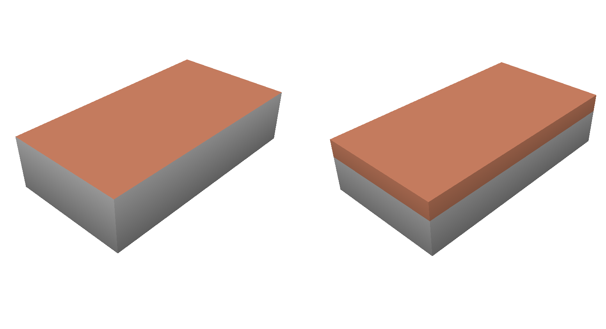

### `skillion`
A single-sloped roof surface. The direction is controlled by `roof:direction`. `roof:direction` can be arbitrary.
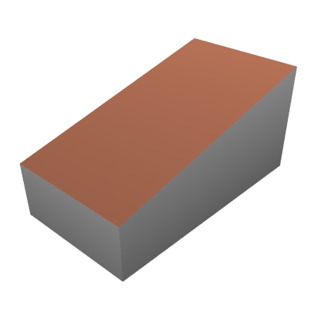

### `gabled`
A classic roof with two sloping sides meeting at a ridge. The orientation (`along` or `across`) can be specified with `roof:orientation`.
`roof:direction` is also supported, but roof orientation snaps to the nearest along/across direction.

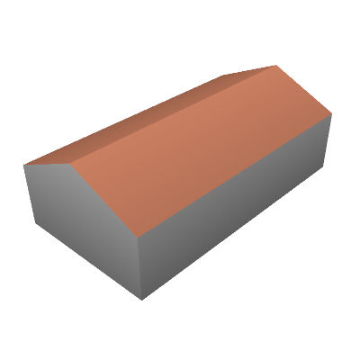

### `hipped`
A roof where all sides slope downwards to the walls.

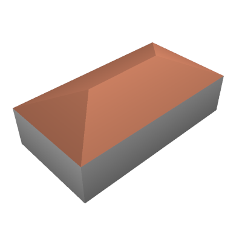

A straight skeleton [algorithm](https://en.wikipedia.org/wiki/Straight_skeleton) is used. So in the case of non-convex building footprints, interesting shapes are created.
Luckily, they are quite close to real architecture.

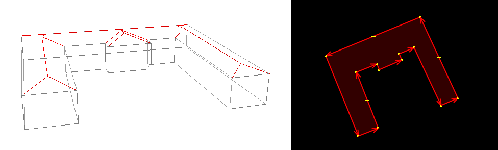

Since this roof shape is completely automatic, neither `roof:direction` nor `roof:orientation` have any effect.

### `half-hipped`
A combination of a gabled and a hipped roof.

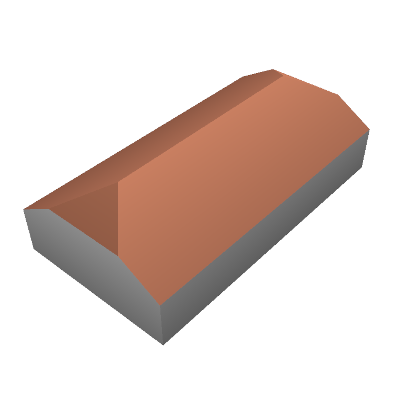

The orientation (`along` or `across`) can be specified with `roof:orientation`.
`roof:direction` is also supported, but roof orientation snaps to the nearest along/across direction.

This roof shape is supported for quadrangular bases only.

### `gambrel`
A symmetrical two-sided roof with two slopes on each side.

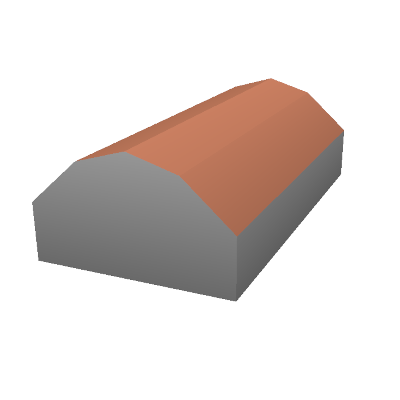

The orientation (`along` or `across`) can be specified with `roof:orientation`.
`roof:direction` is also supported, but roof orientation snaps to the nearest along/across direction.

### `round`
A round, semi-cylinder or hangar-like roof.

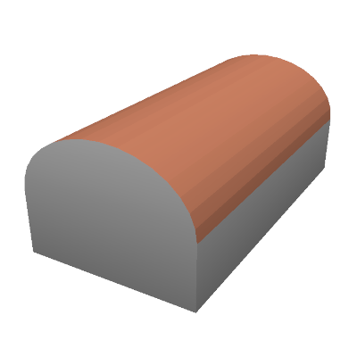

The orientation (`along` or `across`) can be specified with `roof:orientation`.
`roof:direction` is also supported, but roof orientation snaps to the nearest along/across direction.

### `mansard`
A four-sided gambrel-style hip roof characterized by two slopes on each of its sides.

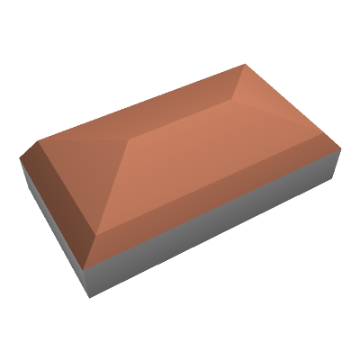

Only quadrangular bases are supported.

### `pyramidal` (or `cone`)
A roof that rises to a single point. Suitable for arbitrary bases. `roof:shape=pyramidal` and `roof:shape=cone` are considered to be complete synonyms.
To get an actual cone, you need a circular base with enough nodes.

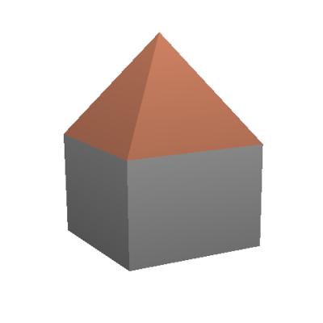

Keys `roof:orientation` and `roof:direction` have no effect for the obvious reason.

### `dome`
A hemispherical roof. Like `pyramidal`, this roof shape is suitable for arbitrary bases. To get a traditional dome, you need a circular base with enough nodes.
In the case of a rectangular base, you will get a modern-like dome.

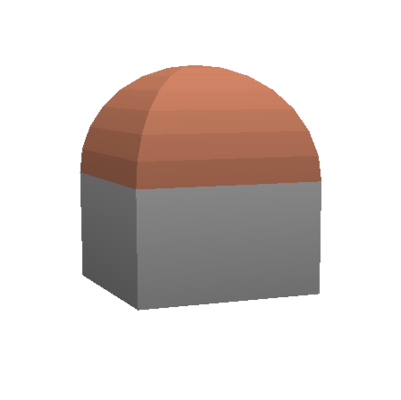

### `onion`
An onion-shaped dome, often found on churches.

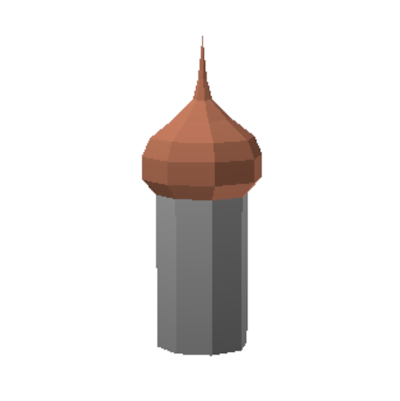

Currently, there are no additional parameters to control the onion shape.
Note: here we follow the F4 map approach, and an original OSM way/relation defines a [tholobate](https://en.wikipedia.org/wiki/Tholobate), and the onion itself gets wider.

### `saltbox`
The saltbox roof is supported as asymmetrical gabled roof in accordance with the corresponding [osm-wiki page](https://wiki.openstreetmap.org/wiki/Tag:roof:shape%3Dsaltbox), with the following exception: 
both front and back eaves have equal height. There is not tagging scheme currently to specify different heights (only `roof:height`).

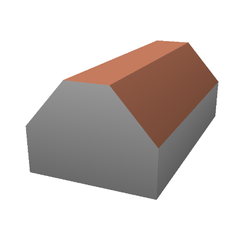

`roof:orientation` can be `along` or `across`, but it cannot unambigously specify roof orientation, due to its assimmetrical nature. `roof:direction` specifies direction of the longer slope.

**Note:** There are several other interpretations in the OSM community what the saltbox roof is.  We follow the _main_ wiki page wit tag definition. F4 map renderes this roof shape differently. 

### `cross_gabled` (or `crosspitched`)
Two gabled roof sections are put together at right angles.

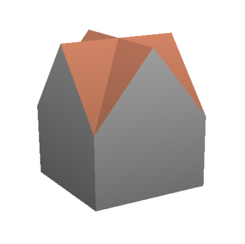

Only quadrangular footprints are supported. Neither `roof:orientation` nor `roof:direction` has any effect.

### `side_hipped`
A one-sided hipped roof: hipped from one side and gabled from the other. Only quadrangular footprints are supported.

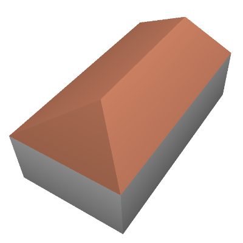 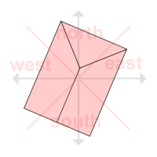

The roof orientation can be controlled via the `roof:direction` tag. The direction value signifies the direction from the roof centroid to the triangular face. `roof:direction=0` or `roof:direction=north` in this example.

This roof shape is particularly useful for building parts, to easily create a building like this:

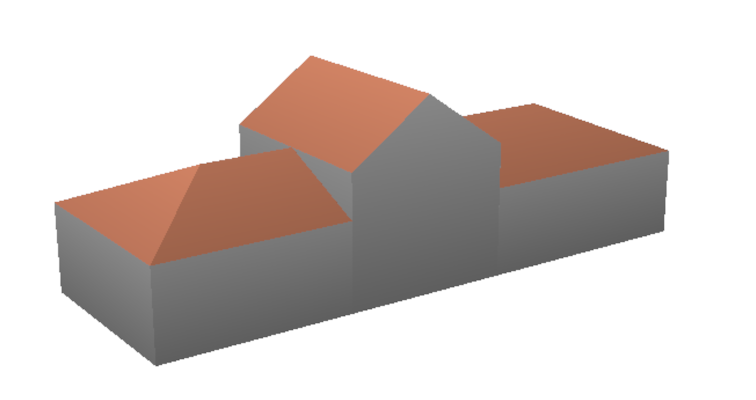

### `side_half-hipped`
A combination of a half-hipped and a gabled roof. One end is half-hipped (a vertical trapezoid wall topped with a small sloped roof triangle), and the other end is a full vertical gable. This is common for semi-detached houses where the whole building has a `half-hipped` roof.

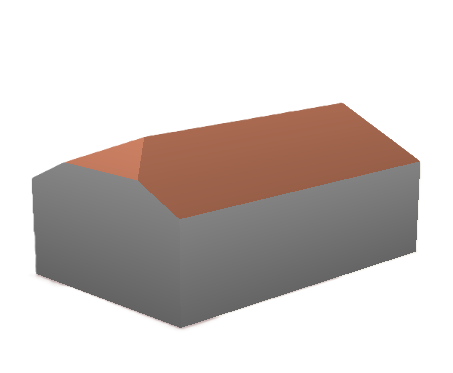

Only quadrangular footprints are supported. The orientation is controlled via the `roof:direction` tag. The direction value signifies the direction from the roof centroid to the half-hipped face.

### `half-dome`
Half of a dome roof. Especially useful for orthodox church architecture.

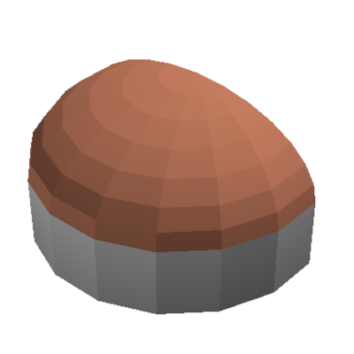

The apex of the dome is located above the middle of the longest side of the base.

### `apse_gabled`
This is a gabled roof with a semicircular apse at one end.

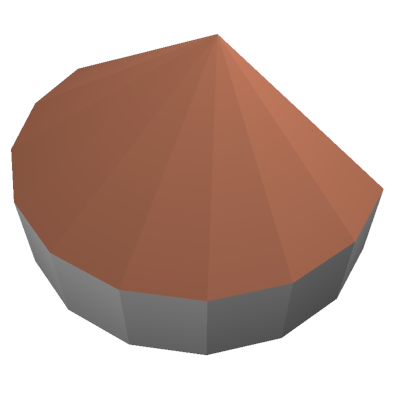

The apex of the apse is located above the middle of the longest side of the base.

### Special `building:part` values

Certain values for the `building:part` tag have a special meaning and affect how the geometry is generated.

#### `building:part=roof`

This tag is intended for parts of a building that consist only of a roof structure, such as canopies, awnings, or visors.

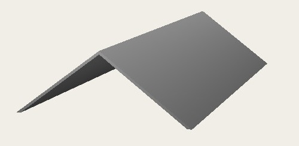

-   When this tag is used, no vertical walls are generated for the object. The model will consist of the roof volume only.
-   The object is positioned at its correct height level, appearing as a floating roof.
-   This behavior can be overridden by explicitly adding the `wall=yes` tag, which will force the walls to be rendered.

#### `building:part=steps`

This value is used to model flights of stairs. It does not have an effect on its own, but works in combination with other tags:

-   This tag works in conjunction with `roof:shape=skillion`. This approach ensures backward compatibility, as other 3D applications will render a sloped ramp, which is a good fallback for stairs. Use `roof:direction` to set the direction of the flight of stairs.
-   The height of each individual step can be controlled with the `step:height` tag. If not provided, a default value of **0.16 meters** is used.

## Supported Building Shapes (`shape`)

The plugin also supports the `shape` tag to define the overall geometry of a building or structure. Note that this is a custom feature and is not part of the [S3DB standard](https://wiki.openstreetmap.org/wiki/Simple_3D_Buildings).

### `hyperboloid`
This shape is used to model hyperboloid structures, common in cooling towers, observation towers, and other architectural designs.

This tag can be applied to `building=*`, `building:part=*`, and the following `man_made` features: `tower`, `water_tower`, `communications_tower`, and `cooling_tower`. It works on closed ways and multipolygons without inner rings.

The geometry of the hyperboloid is controlled by two additional tags:

- `hyperboloid:top_rate`: Defines the relative width of the top of the structure compared to its base. A value greater than 1 makes the top wider than the base, while a value less than 1 makes it narrower.
- `hyperboloid:middle_rate`: Defines the relative width of the narrowest part (the "waist") of the structure, as a ratio of the base width. It ranges from 0 (a single point) to 1 (no narrowing). `hyperboloid:middle_rate` cannot be greater than `hyperboloid:top_rate`.

Unlike F4Map, the plugin does not *assume* a hyperboloid shape for any object, even for cooling towers; the `shape=hyperboloid` tag must be set manually.

## Barriers

The plugin also supports rendering of `barrier` objects (`barrier=*`)

- `barrier=wall`: Rendered as a wall with a default width of 0.25m and height of 1.5m.
- `barrier=hedge`: Rendered as a hedge with a default width of 0.5m and height of 1.5m.
- `barrier=fence`: Rendered as a fence with a default width of 0.1m and height of 1.5m.
- `barrier=city_wall`: Rendered as a wall with a default width of 1m and height of 5m.

For all barrier types, the following tags can be used to override the default values:

- `height`: The height of the barrier.
- `width`: The width of the barrier.
- `colour`: The color of the barrier.

Note that in OSM `barrier=*` is considered to be a linear object, even if the way is closed. To override this, use the `area=yes` tag. In the later case the `width` tag is not applied.

## Natural Features

The plugin renders some natural features to provide more context to the 3D scene.

### Trees

-   Nodes tagged with `natural=tree` are rendered as 3D models.
-   The rendering uses a simple "billboard" or "cross-plane" technique with a tree texture.
-   The `height` tag can be used to specify the height of the tree. If not present, a default height is used.
-   The `leaf_type` tag can be used to select a specific "type" of tree. Supported values are `broadleaved` and `needleleaved`.
-   The plugin includes a built-in database of tree species. If the `species` or `genus` tag is present, the plugin automatically infers the `leaf_type` (`broadleaved` or `needleleaved`). 
-   **Validation:** The JOSM validator alerts the user if an unknown or misspelled `species` or `genus` tag is used, helping to maintain data quality in OSM.
-   The tree species database is derived from the [OSM Wiki: List of Species](https://wiki.openstreetmap.org/wiki/Tag:natural%3Dtree/List_of_Species). It is updated periodically by a maintainer-run script.

### Forests

-   Areas tagged with `natural=wood` or `landuse=forest` are automatically populated with 3D tree models.
-   **Density Control:** The density of trees can be adjusted in the plugin preferences using the "Forest density" slider.

## Ground Plane

The ground plane in the 3D window provides geographical context with "flat" objects: roads, rivers, grassland e.t.c. It supports two main modes:

- **Satellite Imagery:** Loads satellite tiles activated in the main JOSM window. Currently only TMS (Tile Map Service) tiles are supported.
- **UrbanEye3D own 2D style:** Renders a 2D map on-the-fly based on loaded OSM data using the plugin's built-in MapCSS styles .

### Controlling the Ground Plane

By default, the 3D window attempts to use the topmost visible satellite layer from the JOSM main window. If no satellite layers are visible, it falls back to own 2D rendering.

You can control this behavior independently:

- **Keyboard Shortcut `SHIFT+E`:** Toggles satellite imagery on and off in the 3D window.
- **Preferences:** A checkbox "Use satellite imagery for ground plane" is available in the plugin settings.

This feature is particularly useful if you want to see satellite imagery in the main JOSM window for editing while seing the end result in the 3D view.

### Sport Pitch Markings

The plugin renders certain objects directly on the ground texture that are difficult to represent with standard MapCSS, such as sport pitch markings.

For objects tagged with `leisure=pitch`, the plugin automatically renders characteristic professional markings based on the `sport` tag.

- `sport=soccer`: Renders FIFA-standard soccer pitch markings.
- `sport=tennis`: Renders professional tennis court markings.
- `sport=volleyball`: Renders FIVB-standard volleyball court markings.
- `sport=badminton`: Renders professional badminton court markings.

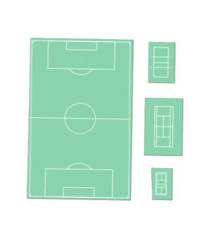

**Automatic Scaling:**
- The markings are automatically aligned along the longest side of the pitch.
- For smaller training grounds or school pitches, the markings are proportionally scaled down to fit within the available space.

---

The Urban Eye is watching you!  

