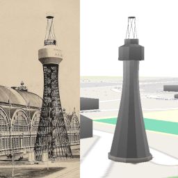
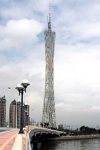
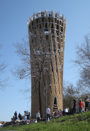
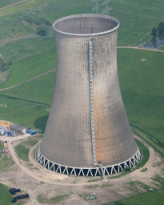
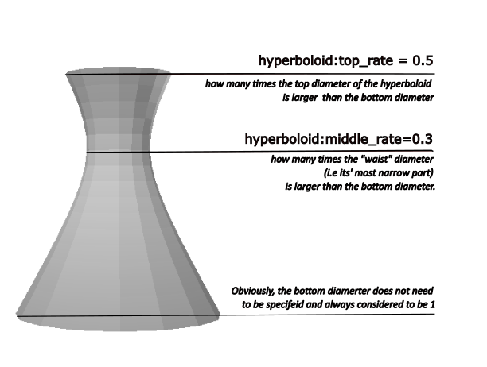

Дорогие друзья! Встречайте новую, очень интересную и возможно очень спорную версию UrbanEye3D — **v1.9.0**.

В ней появились **гиперболоидные** конструкции! Теперь поддерживается тег `shape=hyperboloid`, и это позволяет легко моделировать здания и сооружения в форме (вы уже догадались) гиперболоида.

### Гиперболоид в архитектуре

Таких зданий и сооружений много во всем мире: от первой шуховской водонапорной башни (1896), которая, к слову сказать, до сих пор сохранилась, и шуховской же радиовышки в Москве (1922) до современных шедевров архитектуры — Телебашни Гуанчжоу (2010) и смотровой башни Jübergtower (2010) в Германии.

 <!--  -->  

Почему архитекторы так любят гиперболоид? Потому что при видимой кривизне его можно собрать из прямых элементов, например, прямых металлических (или даже деревянных) балок. Это придаёт ему прочность и лёгкость при минимальном расходе материалов. Упомянутая Jübergtower собрана из 240 деревянных брусьев.

Кроме того, гиперболоидная форма часто встречается в промышленной архитектуре. Очень распространены гиперболоидные градирни (`man_made=tower` + `tower:type=cooling`). Плавные изгибы не только придают сооружению прочность при минимальном расходе материалов, но и работают как аэродинамическое сопло. Сужение в центральной части («талия» гиперболоида) ускоряет поток влажного воздуха, словно втягивая его вверх, а последующее расширение способствует его эффективному рассеиванию в атмосфере.

### Что поддерживается в UrbanEye3D

1.  **Тег `shape=hyperboloid`** — если его поставить, здание или его часть приобретают гиперболоидную форму. 
    * Автоматически гиперболоидная форма ничему не присваивается (даже градирням), её нужно ставить вручную. F4 ставит гиперболоидную форму автоматически, но по какому-то очень мутному алгоритму, я так не хочу. 
	* Тег можно ставить на здания (`building=*`), на части `building:part=*` и на башни (`man_made=tower`). Если скажете, к чему ещё можно применять эту форму, — добавлю.
	* Тег работает на веях и мультиполигонах без дырок. На зданиях с дырками тег пока не работает, увы.

2.  **Форма гиперболоида** задаётся тегами `hyperboloid:top_rate` и `hyperboloid:middle_rate`.
    *   `hyperboloid:top_rate` — относительная ширина в верхней части. Может быть от 0 до бесконечности (значения больше 1 расширяют верх, меньше 1 — сужают).
    *   `hyperboloid:middle_rate` — относительная ширина в средней, самой узкой части («талии»), от 0 до 1, где 0 соответствует полному сужению в точку, а 1 — отсутствию сужения. `hyperboloid:middle_rate` не может быть быть больше `hyperboloid:top_rate`
	
	Подбирайте значения, чтобы добиться нужной степени кривизны.
	
	

Теперь, ребятки, всё в ваших руках. Идите в JOSM, включайте плагин и моделируйте!
Работы непочатый край: [en.wikipedia.org/wiki/List_of_hyperboloid_structures](https://en.wikipedia.org/wiki/List_of_hyperboloid_structures)!😉