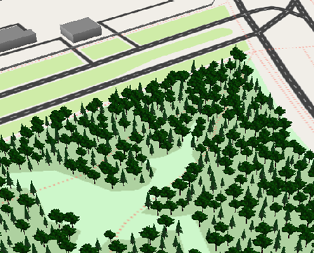
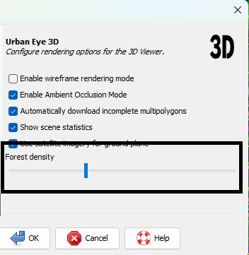
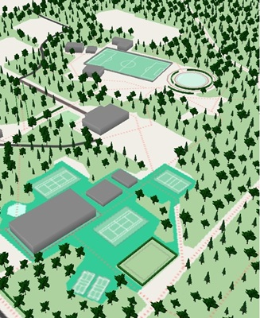
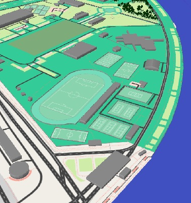
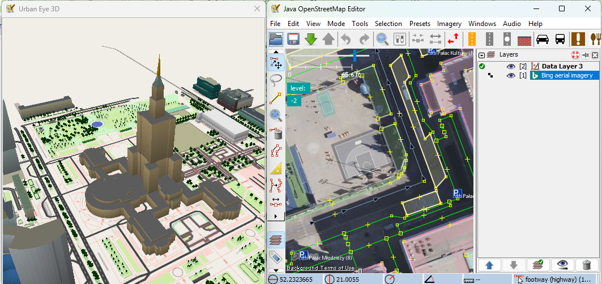
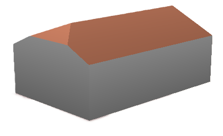
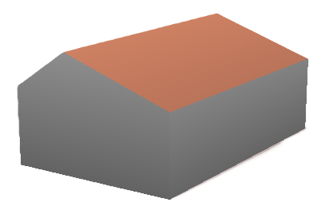
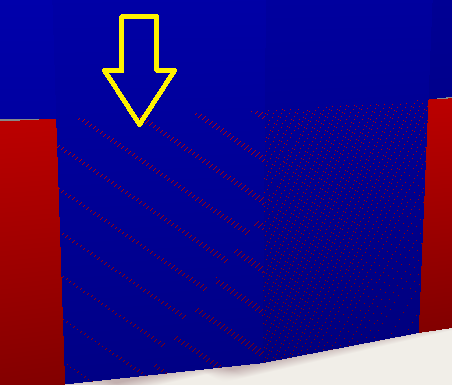

# Urban Eye 3D v2.2.0 - Forests and Pitches

This is a follow-up release with minor enhancements, requested by plugin users. 

### 🌲 Automatic Forest Generation
Polygons with `natural=wood` and `landuse=forest` are populated with tree models.
*   **Natural Distribution:** Using Poisson Disk Sampling, trees are placed organically, avoiding unnatural clusters.
*   **Density Control:** A new slider in the plugin preferences allows you to adjust tree density in real-time to match your hardware's capabilities.

 

### ⚽ Sport Pitch Markings
For objects tagged with `leisure=pitch`, the plugin now renders characteristic markings based on the `sport` tag.
*   **Supported Sports:** Soccer (FIFA standard), Tennis, Volleyball (FIVB), and Badminton.
*   **Smart Scaling:** Markings automatically align along the longest side and scale proportionally for smaller training or school grounds.

 

### 🗺️ Independent imagery in 3D view
In the previous versions of the plugin, selected satellite imagery layer was displayed as a base layer in the plugin 3D window. Now it's possible to alter this behavior, and **disable satellite imagery in 3D view**. This allows a more natural workflow: edit map using a satellite imagery (as many editors do) and immediately see how the plugin renders it in 3D window.

Bing in 2d view and Urban Eye style in 3D view.

*   **A new preference** "Use satellite imagery for ground plane" allows you to control 3D ground imagery independently of the 2D view.
*   **Quick Toggle:** Use the `Shift+E` keyboard shortcut to instantly switch between satellite imagery and the built-in MapCSS style in the 3D window.

### 🏠 New Roof Shapes & Improvements
*   **Side Half-Hipped:** Perfect for semi-detached houses, providing a transition between a half-hipped end and a vertical gable.
*   **Improved Saltbox:** Reimplemented to match the OSM wiki standard with asymmetrical slopes.

|  |  |
| ------------- | ------------- |
| `roof:shape=side_half-hipped`  | `roof:shape=saltbox`  |

### 🛡️ Enhanced Validation
New check has been added to Validator to find flickering coplanar walls. 

In 3D modeling, **coplanar walls** occur when two or more surfaces share the exact same geometric plane. This is a common issue when `building:part` objects overlap and share the same boundary. According to the [Simple 3D Buildings (S3DB)](https://wiki.openstreetmap.org/wiki/Simple_3D_Buildings#Building_parts) standard, volumes of building parts should not overlap, as it creates ambiguity and visual artifacts.

The most notorious of these artifacts is **Z-fighting** — an ugly flickering effect that happens when the renderer cannot decide which surface is "in front" of the other.

Example: the lower part of the building is both blue and red. 

 

But the validator can find it and you can fix it (in this case probably specifying `min_height` value for the upper part)

### Other improvements and fixes
*   **UI:** Scene statistics overlay (objects, faces, FPS) with toggle in preferences.
*   **Performance:** Implemented Frustum Culling to skip rendering of objects outside the view.
*   **Roofs**: `roof:shape=many` is now rendered as `hipped` for buildings, providing a much better visual result than a flat roof.

---
The Urban Eye is watching you! 👁️
