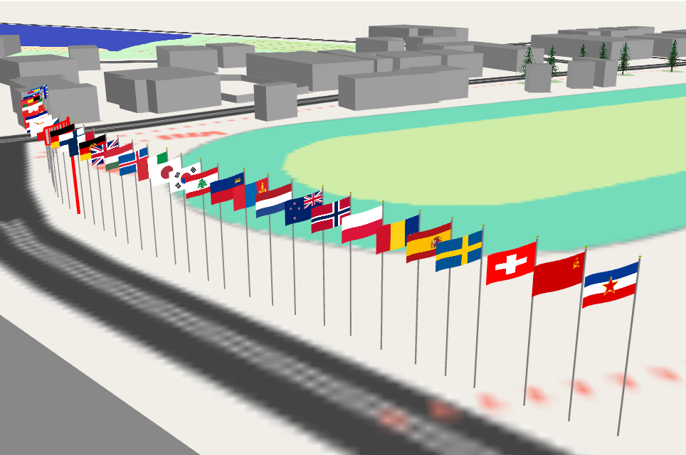
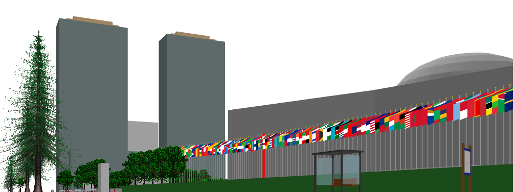
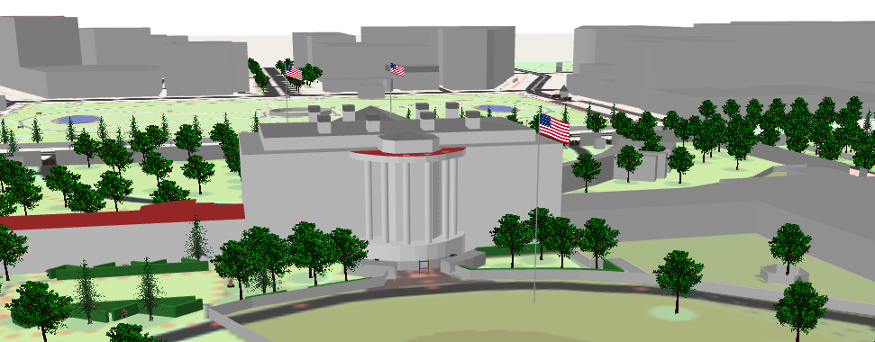

# v2.6.2 All Nations, All Flags

In this version we present textured flags.
The `flag:wikidata` is mainly considered, but other popular tags, like `flag:name`, `subject`, `subject:wikidata`, `country`,  `brand` are also used to select texture.

### Examples

**James B. Sheffield Olympic Skating Rink, Lake Placid US**

From the OSM Note:
>The flags along this street are of each of the NOCs that participated in the 1980 Winter Olympics, except for the U.S.; an ORDA flag takes its place

**United Nations building**

**The White House**

### How does it work

For a flag to appear in the plugin, three things are required:
* The flag must be represented by a Wikidata item (for example: https://www.wikidata.org/wiki/Q172446)
* That wikidata item must contain an SVG image of the flag in the `P18 image` property.
* The flag must be tagged with the `flag:wikidata` tag at least five times in OSM (in this example, `flag:wikidata=Q172446`).

Since the flag textures are stored in the plugin file itself, new flags will be added to the plugin as new versions are released.