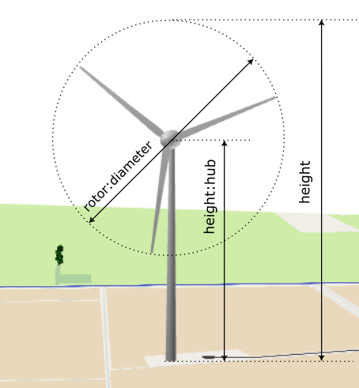
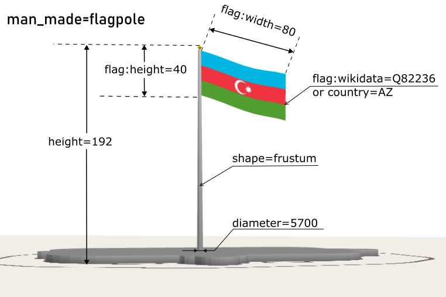
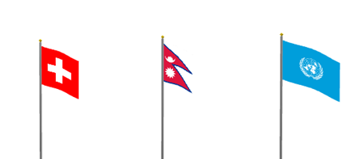
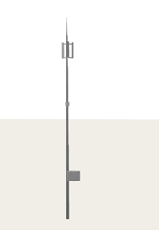

# v2.8.0 October Wind

*In this release the October wind blows through the scene: it fills the flagpoles, turns the wind turbines — well, almost. The rotors stay put for now, but they do look like they want to spin. :)*

## Wind Turbines

Wind turbines (**`power=generator` + `generator:source=wind`, or `generator:method=wind_turbine`**) are large and highly visible objects. In some countries, entire fields are covered with them. In OSM, there are over 400,000 of them, which is a significant number.

Wind turbines are now rendered in 3D using a procedural model: a three-bladed rotor with a nacelle on a tapered tower, built to match the OSM height and realistic proportions.

*   **Height-aware geometry:** 
    *   `height`  defines the total height of the model: from the ground to ther rotor tip in its highest positon. 
    *   `rotor:diameter` — rotor diameter; if absent, derived as ~66% of the height.
    *   `height:hub` — from the ground to the center of rotor axis; if absent, derived from the height, leaving ~0.5 rotor-diameter clearance below the rotor. (Note: the OSM tag is `height:hub`, not `hub:height` as one might expect.)
    *   `min_height` — lifts the whole turbine above the ground.
*   **Color:** the `colour` tag is respected and applied to the whole model — hub, rotor and nacelle.
*   **No clones:** the rotor phase is randomized per object, so wind farms don't look stamped.
*   **Limitations:** a single rotor and nacelle design for now. No animations yet :)

## New Tags for Flagpoles
Support for textured flags was added in the previous version, but it quickly became apparent that large, world-famous flagpoles (such as those in [Baku](https://en.wikipedia.org/wiki/State_Flag_Square_(Baku)) or [Minsk](https://en.wikipedia.org/wiki/State_Flag_Square_(Minsk))) did not look convincing enough.
For one thing, their masts are quite thick but taper towards the top. Secondly, the flag itself can reach record-breaking dimensions rather than just average ones.
Consequently, support for a few new tags had to be added.

*   **Flag cloth size:** `flag:width` and `flag:height` tags are now supported for `man_made=flagpole`.  When the tags are absent, the flag cloth is scaled non-linearly based on the mast height.
*   **Pole shape** can be controlled using the `shape` tag. Supported values are `shape=frustum` and `shape=prism` (default).
*   **`diameter`**  of the pole can also be specified. Remember, it's in **millimeters**!

## Flag Proportions
Most flags look fine with a 2:3 aspect ratio, but the flags of certain countries have non-standard proportions. 
In this version, I have hard-coded the aspect ratios for the flags of Switzerland, Nepal, and the Vatican. 
Support for other ratios, such as 1:2 or 3:5, is a task for the future. If you consider this important, please let me know.

## Communication Masts

**Communication masts** (`man_made=mast` + `tower:type=communication`) are rendered via a procedural model — a telescopic tube mast with an antenna head on top.

*   The mast respects the `height` (and `min_height`) tags: the body scales to the exact height while keeping proper antenna proportions.
*   The `colour` tag  defines the colour for the whole model.

## Bugfixes

*   Fixed a bug with `roof:direction` for `roof:shape=saltbox` (the asymmetric roof shape).

## Documentation & Under the Hood

*   A [manual for assets.mapcss](../../asset_mapcss_manual.md) has been created.  I hope it could be helpful for contributors :)
*   Wind-turbine statistics added to the `misc` data pipeline; internal layout cleanup of roof and street-furniture meshers.

---
The Urban Eye is watching you!
